# Winter Design DDC Starter 合并指南（策略模式 + 规则树）

> 将项目根目录 `README.md` 与文档 `docs/rule-tree-and-chain.md` 合并为一份统一的指南，重排章节结构，便于整体理解与扩展。

## 目录
- [策略模式总览](#策略模式总览)
  - [设计思想](#设计思想)
  - [核心抽象（策略模式）](#核心抽象策略模式)
  - [模型设计图](#模型设计图)
  - [示例模块与整体实现图](#示例模块与整体实现图)
  - [快速开始](#快速开始)
  - [扩展新的策略](#扩展新的策略)
  - [注意事项](#注意事项)
  - [License](#license)
- [规则树与责任链](#规则树与责任链)
  - [业务背景与目标](#业务背景与目标)
  - [核心概念](#核心概念)
  - [示例结构映射](#示例结构映射)
  - [手动装配（无DI）](#手动装配无di)
  - [执行时序（Sequence Diagram）](#执行时序sequence-diagram)
  - [流程图（Flowchart）](#流程图flowchart)
  - [业务流程图（Business Process）](#业务流程图business-process)
  - [泳道图（Swimlane）](#泳道图swimlane)
  - [类作用说明](#类作用说明)
  - [示例代码（带中文注释）](#示例代码带中文注释)
  - [设计要点与取舍](#设计要点与取舍)
  - [如何使用](#如何使用)
  - [快速试跑](#快速试跑)
  - [小结](#小结)

---

## 策略模式总览

### 设计思想
- 用领域枚举绑定策略，枚举提供稳定的 `code` 与人类可读的 `desc`；工厂以 `code → strategy` 映射管理策略实现。
- 策略接口统一约定 `execute(Object...)` 与 `getStrategyType()`；建议将实际入参封装为强类型领域对象（如 `PaymentRequest`），提升类型安全与可维护性。
- 工厂支持两种来源：
  - Java SPI 自动发现：在 `META-INF/services/<策略接口全名>` 中声明实现类，构造工厂时自动加载。
  - 运行期手动注册：构造或调用时追加策略，实现更灵活的扩展场景。
- 通过 `EnumUtils.getByCode` 从整型 `code` 安全映射到枚举实例，适合持久化、对外协议或前端传参场景。

### 核心抽象（策略模式）
```java
// BaseEnum：统一的枚举抽象接口
public interface BaseEnum {
    int getCode();
    String getDesc();
}

// BaseStrategy：通用策略接口，绑定枚举类型 T
public interface BaseStrategy<T extends Enum<T> & BaseEnum> {
    void execute(Object... params);
    T getStrategyType();
}

// EnumUtils：按 code 查找枚举实例
public final class EnumUtils {
    public static <E extends Enum<E> & BaseEnum> E getByCode(Class<E> enumClass, int code) { /*...*/ }
}

// AbstractStrategyFactory：策略工厂（SPI + 手动注册）
public abstract class AbstractStrategyFactory<T extends Enum<T> & BaseEnum, S extends BaseStrategy<T>> {
    public void registerStrategy(S strategy) { /*...*/ }
    public void registerStrategies(Collection<S> strategies) { /*...*/ }
    public S getStrategy(T type) { /*...*/ }
    public S getStrategy(int code, Class<T> enumClass) { /*...*/ }
    public Map<Integer, S> getAllStrategies() { /*...*/ }
}
```

#### 为什么这么做，带来哪些好处
- 解耦与内聚：业务枚举明确策略类型边界，策略实现仅关注自身逻辑；工厂负责生命周期与查找，职责清晰。
- 可插拔扩展：SPI 自动发现让新增策略“零改造”；手动注册适配运行期动态扩展或非 SPI 场景。
- 统一映射与稳定标识：以枚举 `code` 为唯一键，便于持久化与跨系统交互，同时保留 `desc` 作为展示文案。
- 类型安全的调用约定：建议用强类型请求对象承载入参，避免 `Object...` 的不安全使用。
- 简化使用：通过枚举或 `code` 即可获取策略，支持多种接入方式（枚举、整型、SPI）。

### 模型设计图
策略抽象的架构图（strategy 文件夹核心类关系）：

```mermaid
classDiagram
    class BaseEnum {
        <<interface>>
        +getCode() int
        +getDesc() String
    }
    
    class BaseStrategy~T~ {
        <<interface>>
        +execute(Object... params) void
        +getStrategyType() T
    }
    
    class EnumUtils {
        <<utility>>
        +getByCode(Class~E~ enumClass, int code)$ E
    }
    
    class AbstractStrategyFactory~T, S~ {
        <<abstract>>
        -Map~Integer, S~ strategyMap
        -Class~S~ strategyClass
        +AbstractStrategyFactory(Class~S~ strategyClass)
        +AbstractStrategyFactory(Class~S~ strategyClass, Collection~S~ strategies)
        +registerStrategy(S strategy) void
        +registerStrategies(Collection~S~ strategies) void
        +getStrategy(T type) S
        +getStrategy(int code, Class~T~ enumClass) S
        +getAllStrategies() Map~Integer, S~
        -loadBySpi() void
    }
    
    BaseStrategy ..> BaseEnum : 绑定枚举类型 T
    AbstractStrategyFactory ..> BaseEnum : 使用 T extends BaseEnum
    AbstractStrategyFactory ..> BaseStrategy : 管理 S extends BaseStrategy
    AbstractStrategyFactory ..> EnumUtils : 使用 code 查找枚举
    
    note for BaseEnum "提供稳定的 code 与描述\n适合持久化与跨系统交互"
    note for BaseStrategy "统一策略执行约定\n建议使用强类型请求对象"
    note for AbstractStrategyFactory "支持 SPI 自动加载\n与手动注册两种方式"
```



### 示例模块与整体实现图
#### 完整代码示例

##### 1. 支付方式枚举（PaymentMethod.java）

```java
package com.zsq.winter.examples.payment;

import com.zsq.winter.design.strategy.BaseEnum;

/**
 * 支付方式枚举，实现 BaseEnum 以提供稳定的 code 与描述。
 */
public enum PaymentMethod implements BaseEnum {
    ALIPAY(1, "支付宝"),
    WECHAT(2, "微信支付"),
    CREDIT_CARD(3, "信用卡");

    private final int code;
    private final String desc;

    PaymentMethod(int code, String desc) {
        this.code = code;
        this.desc = desc;
    }

    @Override
    public int getCode() { 
        return code; 
    }

    @Override
    public String getDesc() { 
        return desc; 
    }
}
```

##### 2. 策略接口（PaymentStrategy.java）

```java
package com.zsq.winter.examples.payment;

import com.zsq.winter.design.strategy.BaseStrategy;

/**
 * 支付策略接口，绑定到 {@link PaymentMethod} 枚举。
 */
public interface PaymentStrategy extends BaseStrategy<PaymentMethod> {
}
```

##### 3. 策略工厂（PaymentStrategyFactory.java）

```java
package com.zsq.winter.examples.payment;

import com.zsq.winter.design.strategy.AbstractStrategyFactory;

import java.util.List;

/**
 * 支付策略工厂，支持 SPI 自动加载与手动追加策略。
 */
public class PaymentStrategyFactory extends AbstractStrategyFactory<PaymentMethod, PaymentStrategy> {

    /**
     * 仅通过 SPI 加载策略实现。
     */
    public PaymentStrategyFactory() {
        super(PaymentStrategy.class);
    }

    /**
     * 通过 SPI 加载并追加手动传入的策略实现。
     *
     * @param extraStrategies 需要额外注册的策略列表
     */
    public PaymentStrategyFactory(List<PaymentStrategy> extraStrategies) {
        super(PaymentStrategy.class, extraStrategies);
    }
}
```

##### 4. 请求模型（PaymentRequest.java）

```java
package com.zsq.winter.examples.payment;

/**
 * 简单的支付请求模型，用于作为策略执行的入参。
 */
public class PaymentRequest {
    private final String orderId;
    private final long amountCents;

    public PaymentRequest(String orderId, long amountCents) {
        this.orderId = orderId;
        this.amountCents = amountCents;
    }

    public String getOrderId() {
        return orderId;
    }

    public long getAmountCents() {
        return amountCents;
    }

    @Override
    public String toString() {
        return "PaymentRequest{" +
                "orderId='" + orderId + '\'' +
                ", amountCents=" + amountCents +
                '}';
    }
}
```

##### 5. 支付宝策略实现（AlipayPaymentStrategy.java）

```java
package com.zsq.winter.examples.payment;

/**
 * 支付宝支付策略实现。
 */
public class AlipayPaymentStrategy implements PaymentStrategy {

    @Override
    public void execute(Object... params) {
        PaymentRequest req = (PaymentRequest) params[0];
        System.out.println("[Alipay] 支付订单:" + req.getOrderId() + ", 金额:" + req.getAmountCents());
    }

    @Override
    public PaymentMethod getStrategyType() {
        return PaymentMethod.ALIPAY;
    }
}
```

##### 6. 微信支付策略实现（WechatPaymentStrategy.java）

```java
package com.zsq.winter.examples.payment;

/**
 * 微信支付策略实现。
 */
public class WechatPaymentStrategy implements PaymentStrategy {

    @Override
    public void execute(Object... params) {
        PaymentRequest req = (PaymentRequest) params[0];
        System.out.println("[Wechat] 支付订单:" + req.getOrderId() + ", 金额:" + req.getAmountCents());
    }

    @Override
    public PaymentMethod getStrategyType() {
        return PaymentMethod.WECHAT;
    }
}
```

##### 7. 信用卡支付策略实现（CreditCardPaymentStrategy.java）

```java
package com.zsq.winter.examples.payment;

/**
 * 信用卡支付策略实现（示例中通过手动注册）。
 */
public class CreditCardPaymentStrategy implements PaymentStrategy {

    @Override
    public void execute(Object... params) {
        PaymentRequest req = (PaymentRequest) params[0];
        System.out.println("[CreditCard] 支付订单:" + req.getOrderId() + ", 金额:" + req.getAmountCents());
    }

    @Override
    public PaymentMethod getStrategyType() {
        return PaymentMethod.CREDIT_CARD;
    }
}
```

##### 8. 使用示例（PaymentDemo.java）

```java
package com.zsq.winter.examples.payment;

import java.util.Arrays;

/**
 * 支付策略使用示例：演示 SPI 加载与手动追加策略的组合使用。
 */
public class PaymentDemo {
    public static void main(String[] args) {
        // 示例 1：仅使用 SPI 加载（Alipay、Wechat）
        PaymentStrategyFactory spiFactory = new PaymentStrategyFactory();
        PaymentRequest req1 = new PaymentRequest("order001", 1999);
        PaymentStrategy wechat = spiFactory.getStrategy(PaymentMethod.WECHAT);
        if (wechat != null) {
            wechat.execute(req1);
        }

        // 通过 code 获取策略（等同于上面的枚举方式）
        PaymentStrategy alipay = spiFactory.getStrategy(1, PaymentMethod.class);
        if (alipay != null) {
            alipay.execute(new PaymentRequest("order002", 2999));
        }

        // 示例 2：在 SPI 基础上手动追加（CreditCard）
        PaymentStrategyFactory mixedFactory = new PaymentStrategyFactory(
                Arrays.asList(new CreditCardPaymentStrategy())
        );
        PaymentStrategy card = mixedFactory.getStrategy(PaymentMethod.CREDIT_CARD);
        if (card != null) {
            card.execute(new PaymentRequest("order003", 8888));
        }
    }
}
```

##### 9. SPI 配置文件

在 `src/main/resources/META-INF/services/` 目录下创建文件：

文件名：`com.zsq.winter.examples.payment.PaymentStrategy`

文件内容：
```
com.zsq.winter.examples.payment.AlipayPaymentStrategy
com.zsq.winter.examples.payment.WechatPaymentStrategy
```

##### 10. 运行输出

```
[Wechat] 支付订单:order001, 金额:1999
[Alipay] 支付订单:order002, 金额:2999
[CreditCard] 支付订单:order003, 金额:8888
```

#### 支付域类关系图

```mermaid
classDiagram
    %% 核心抽象层（strategy 文件夹）
    class BaseEnum {
        <<interface>>
        +getCode() int
        +getDesc() String
    }
    
    class BaseStrategy~T~ {
        <<interface>>
        +execute(Object... params) void
        +getStrategyType() T
    }
    
    class AbstractStrategyFactory~T, S~ {
        <<abstract>>
        +getStrategy(T type) S
        +getStrategy(int code, Class~T~ enumClass) S
        +registerStrategy(S strategy) void
    }
    
    %% 支付域实现层（examples.payment 文件夹）
    class PaymentMethod {
        <<enumeration>>
        ALIPAY(1, "支付宝")
        WECHAT(2, "微信支付")
        CREDIT_CARD(3, "信用卡")
        -int code
        -String desc
        +getCode() int
        +getDesc() String
    }
    
    class PaymentStrategy {
        <<interface>>
    }
    
    class PaymentStrategyFactory {
        +PaymentStrategyFactory()
        +PaymentStrategyFactory(List~PaymentStrategy~ extras)
    }
    
    class AlipayPaymentStrategy {
        +execute(Object... params) void
        +getStrategyType() PaymentMethod
    }
    
    class WechatPaymentStrategy {
        +execute(Object... params) void
        +getStrategyType() PaymentMethod
    }
    
    class CreditCardPaymentStrategy {
        +execute(Object... params) void
        +getStrategyType() PaymentMethod
    }
    
    class PaymentRequest {
        -String orderId
        -long amountCents
        +getOrderId() String
        +getAmountCents() long
    }
    
    class PaymentDemo {
        +main(String[] args)$ void
    }
    
    %% 继承与实现关系
    PaymentMethod ..|> BaseEnum : 实现
    PaymentStrategy --|> BaseStrategy : 继承
    PaymentStrategyFactory --|> AbstractStrategyFactory : 继承
    
    AlipayPaymentStrategy ..|> PaymentStrategy : 实现
    WechatPaymentStrategy ..|> PaymentStrategy : 实现
    CreditCardPaymentStrategy ..|> PaymentStrategy : 实现
    
    %% 依赖关系
    PaymentStrategy ..> PaymentMethod : 绑定枚举
    PaymentStrategyFactory ..> PaymentStrategy : 管理
    PaymentStrategyFactory ..> PaymentMethod : 使用
    
    AlipayPaymentStrategy ..> PaymentRequest : 使用
    WechatPaymentStrategy ..> PaymentRequest : 使用
    CreditCardPaymentStrategy ..> PaymentRequest : 使用
    
    PaymentDemo ..> PaymentStrategyFactory : 创建工厂
    PaymentDemo ..> PaymentStrategy : 获取策略
    PaymentDemo ..> PaymentRequest : 创建请求
    
    note for PaymentMethod "领域枚举：定义支付方式\ncode 用于持久化与映射"
    note for PaymentStrategyFactory "工厂：SPI 加载 Alipay/Wechat\n手动注册 CreditCard"
    note for PaymentRequest "强类型请求对象\n提升类型安全"
```



#### 策略执行流程图

```mermaid
sequenceDiagram
    autonumber
    participant Demo as 💻 PaymentDemo
    participant Factory as 🏭 PaymentStrategyFactory
    participant SPI as 🔌 ServiceLoader(SPI)
    participant Strategy as 🎯 PaymentStrategy
    participant Request as 📦 PaymentRequest
    
    Note over Demo,Factory: 🔵 场景1：SPI 自动加载
    Demo->>+Factory: new PaymentStrategyFactory()
    Factory->>+SPI: ServiceLoader.load(PaymentStrategy.class)
    SPI-->>-Factory: AlipayPaymentStrategy, WechatPaymentStrategy
    Factory->>Factory: registerStrategy(each)
    Factory-->>-Demo: 工厂实例
    
    Demo->>+Factory: getStrategy(PaymentMethod.WECHAT)
    Factory-->>-Demo: WechatPaymentStrategy
    Demo->>+Request: new PaymentRequest("order001", 1999)
    Request-->>-Demo: 请求对象
    Demo->>+Strategy: execute(request)
    Strategy->>Strategy: 处理微信支付逻辑
    Strategy-->>-Demo: 执行完成
    
    
    Note over Demo,Factory: 🟢 场景2：通过 code 获取策略
    Demo->>+Factory: getStrategy(1, PaymentMethod.class)
    Factory->>Factory: EnumUtils.getByCode(PaymentMethod, 1)
    Note right of Factory: code=1 → ALIPAY
    Factory->>Factory: strategyMap.get(ALIPAY.code)
    Factory-->>-Demo: AlipayPaymentStrategy
    Demo->>+Request: new PaymentRequest("order002", 2999)
    Request-->>-Demo: 请求对象
    Demo->>+Strategy: execute(request)
    Strategy->>Strategy: 处理支付宝支付逻辑
    Strategy-->>-Demo: 执行完成
    
    Note over Demo,Factory: 🟠 场景3：SPI + 手动注册
    Demo->>+Factory: new PaymentStrategyFactory(List.of(CreditCardStrategy))
    Factory->>+SPI: ServiceLoader.load(PaymentStrategy.class)
    SPI-->>-Factory: AlipayPaymentStrategy, WechatPaymentStrategy
    Note right of Factory: SPI 加载完成
    Factory->>Factory: registerStrategies(extras)
    Note right of Factory: 手动注册 CreditCard
    Factory-->>-Demo: 工厂实例
    
    Demo->>+Factory: getStrategy(PaymentMethod.CREDIT_CARD)
    Factory-->>-Demo: CreditCardPaymentStrategy
    Demo->>+Request: new PaymentRequest("order003", 8888)
    Request-->>-Demo: 请求对象
    Demo->>+Strategy: execute(request)
    Strategy->>Strategy: 处理信用卡支付逻辑
    Strategy-->>-Demo: 执行完成
```



#### 策略注册与查找流程图

```mermaid
flowchart TD
    Start([开始使用策略模式]) --> Choice{选择加载方式}
    
    Choice -->|SPI 自动加载| SPI[🔌 配置 SPI 文件]
    Choice -->|手动注册| Manual[✋ 准备策略实例列表]
    Choice -->|混合模式| Both[🔄 SPI + 手动]
    
    SPI --> SPIFile[📄 META-INF/services/<br/>PaymentStrategy]
    SPIFile --> SPIContent[声明实现类:<br/>AlipayPaymentStrategy<br/>WechatPaymentStrategy]
    SPIContent --> CreateFactory1[new PaymentStrategyFactory]
    
    Manual --> ManualList[List.of<br/>CreditCardPaymentStrategy]
    ManualList --> CreateFactory2[new PaymentStrategyFactory<br/>extras]
    
    Both --> BothConfig[SPI 文件 + 额外列表]
    BothConfig --> CreateFactory3[new PaymentStrategyFactory<br/>extras]
    
    CreateFactory1 --> FactoryInit{工厂初始化}
    CreateFactory2 --> FactoryInit
    CreateFactory3 --> FactoryInit
    
    FactoryInit -->|1| LoadSPI[🔌 loadBySpi<br/>ServiceLoader.load]
    LoadSPI --> RegisterSPI[📝 registerStrategy<br/>for each SPI strategy]
    
    FactoryInit -->|2| LoadManual[✋ registerStrategies<br/>extras]
    
    RegisterSPI --> StrategyMap[(🗺️ strategyMap<br/>code → strategy)]
    LoadManual --> StrategyMap
    
    StrategyMap --> Ready[✅ 工厂就绪]
    
    Ready --> GetChoice{获取策略方式}
    
    GetChoice -->|枚举| GetByEnum[getStrategy<br/>PaymentMethod.WECHAT]
    GetChoice -->|code| GetByCode[getStrategy<br/>1, PaymentMethod.class]
    
    GetByEnum --> DirectGet[strategyMap.get<br/>type.getCode]
    GetByCode --> EnumConvert[EnumUtils.getByCode<br/>code → enum]
    EnumConvert --> DirectGet
    
    DirectGet --> StrategyInstance[🎯 策略实例]
    
    StrategyInstance --> CreateRequest[📦 new PaymentRequest<br/>orderId, amount]
    CreateRequest --> Execute[⚡ strategy.execute<br/>request]
    
    Execute --> Business[💼 执行业务逻辑]
    Business --> End([完成])
    
    style Start fill:#e1f5ff
    style Choice fill:#fff4e1
    style SPI fill:#e8f5e9
    style Manual fill:#fff3e0
    style Both fill:#f3e5f5
    style FactoryInit fill:#ffebee
    style StrategyMap fill:#e0f2f1
    style Ready fill:#c8e6c9
    style GetChoice fill:#fff9c4
    style StrategyInstance fill:#b2dfdb
    style Execute fill:#ffccbc
    style Business fill:#d1c4e9
    style End fill:#e1f5ff
```



### 快速开始
- 在 `src/main/resources/META-INF/services/` 添加 SPI 配置文件，声明策略实现类。
- 使用 `PaymentStrategyFactory` 通过枚举或 `code` 获取策略并执行。

### 扩展新的策略
- 新增枚举项并确保 `code` 唯一与稳定（适合持久化与跨系统交互）。
- 新增策略实现并返回该枚举项；入参尽量使用强类型请求对象以确保类型安全。
- 选择 SPI 或手动注册：
  - SPI：在 `META-INF/services/<策略接口全名>` 添加实现类全名，工厂自动发现。
  - 手动：在构造工厂或运行时调用 `registerStrategies(...)` 追加。

### 注意事项
- 并发与生命周期：默认实现未做并发保护，建议在应用启动阶段完成策略注册（实现 InitializingBean 或使用 @PostConstruct）；如需运行期动态变更，请在外层加同步控制。

### License
本项目基于 Apache-2.0 许可证发布，详情参见 `pom.xml` 中的声明。

---

## 规则树与责任链

### 业务背景与目标
- 背景：在风控/营销等业务场景中，需要根据用户的“账户标签”（如是否冻结、是否拦截）和“会员等级”等动态信息，决定后续处理策略。例如，在支付受理、账户开户、活动发放等流程中，根据风险与等级做出差异化处理。
- 目标：通过规则树进行“路由决策”，并在必要节点使用并发预处理（如并行查询标签与授信数据），最终将请求导向不同的会员级别策略节点（MemberLevel1/MemberLevel2），返回不同的处理结果或进一步动作。
- 价值：
  - 规则清晰：每个节点聚焦于自身逻辑与决策条件，路由关系一目了然。
  - 性能可控：在含数据密集的节点使用 `multiThread` 并发预处理，降低主流程阻塞。
  - 扩展容易：新增策略节点或调整决策条件，只需在相应节点的 `get()` 方法内变更即可。

### 核心概念
- 规则树（Strategy Router）
  - 以“路由”的方式在多个策略节点间做决策与跳转。
  - 基类 `com.zsq.winter.design.tree.AbstractStrategyRouter` 与 `AbstractMultiThreadStrategyRouter` 定义了路由骨架：
    - `get()` 决策下一个策略节点。
    - `apply()` 执行受理逻辑，`router()` 调用下一个策略节点。
- 责任链（Chain of Responsibility）
  - 多个处理器串联，每个节点按需处理并传递给下一个节点。
  - 在本示例中，规则树的“节点跳转”体现了类似责任链的传递思想：节点在受理后根据上下文选择并“交棒”给下一个节点。

### 示例结构映射
- 示例节点
  - `RootNode`：根节点，调用 `SwitchRoot`。
  - `SwitchRoot`：中间切换节点，路由到 `AccountNode`。
  - `AccountNode`：业务节点，进行异步数据加载与等级判断，路由到 `MemberLevel1Node` 或 `MemberLevel2Node`。
  - `MemberLevel1Node` / `MemberLevel2Node`：叶子节点，返回最终结果。
- 工厂
  - `DefaultStrategyFactory`：手动实例化并组装上述节点与线程池，提供统一入口 `strategyHandler()`。
- 上下文
  - `DefaultStrategyFactory.DynamicContext`：在节点间共享的业务上下文，存储动态数据（如账号标签、等级等）。

### 手动装配（无DI）

示例不再使用 `@Component`、`@Autowired`、`@Resource` 等注解，而是通过构造函数注入：

```
MemberLevel1Node level1 = new MemberLevel1Node();
MemberLevel2Node level2 = new MemberLevel2Node();
ThreadPoolExecutor pool = (ThreadPoolExecutor) Executors.newFixedThreadPool(Runtime.getRuntime().availableProcessors());
AccountNode account = new AccountNode(level1, level2, pool);
SwitchRoot switchRoot = new SwitchRoot(account);
RootNode root = new RootNode(switchRoot);
```

### 执行时序（Sequence Diagram）

```mermaid
sequenceDiagram
    autonumber
    participant C as 👤 Client
    participant F as 🏭 DefaultStrategyFactory
    participant R as 🌳 RootNode
    participant S as 🔀 SwitchRoot
    participant A as 🧮 AccountNode
    participant L1 as ⭐ MemberLevel1Node
    participant L2 as ⭐⭐ MemberLevel2Node

    C->>F: strategyHandler()
    F-->>C: 🌳 RootNode 处理器实例
    C->>R: apply(request, context)
    activate R
    R->>R: multiThread()（默认空实现）
    R->>R: doApply() 记录日志
    R->>R: router(request, context)
    R->>R: get() => 🔀 SwitchRoot
    deactivate R

    C->>S: apply(request, context)
    activate S
    S->>S: multiThread()（默认空实现）
    S->>S: doApply() 记录日志
    S->>S: router()
    S->>S: get() => 🧮 AccountNode
    deactivate S

    C->>A: apply(request, context)
    activate A
    A->>A: multiThread() 🧵 并发查询账号标签/授信数据
    A->>A: doApply() 🔢 模拟查询用户等级并写入 context
    A->>A: router()
    A->>A: get() 🔍 根据标签/等级选择 ⭐ 或 ⭐⭐
    deactivate A

    alt 命中冻结/拦截/等级=1
        C->>L1: apply(request, context)
        L1-->>C: 返回 ⭐ level1 + 上下文
    else 正常
        C->>L2: apply(request, context)
        L2-->>C: 返回 ⭐⭐ level2 + 上下文
    end
```



### 流程图（Flowchart）

```mermaid
flowchart TD
    A[开始: Client 获取处理器]
    B[Factory.strategyHandler 返回 RootNode]
    C[RootNode.doApply 记录日志]
    D[RootNode.router 路由到 SwitchRoot]
    E[SwitchRoot.doApply 记录日志]
    F[SwitchRoot.router 路由到 AccountNode]
    G[AccountNode.multiThread 并发查询标签与授信]
    H[AccountNode.doApply 写入用户等级]
    I{根据标签与等级决策}
    J[MemberLevel1Node.apply 返回 level1]
    K[MemberLevel2Node.apply 返回 level2]
    L[结束]

    A --> B --> C --> D --> E --> F --> G --> H --> I
    I -->|冻结/拦截/等级=1| J --> L
    I -->|正常| K --> L
```



### 业务流程图（Business Process）

```mermaid
flowchart LR
    U[👤 用户] --> G[🚪 接入层/API网关]
    G --> R[🧠 规则树引擎]

    subgraph P [🧵 并发预处理]
        R --> A1[📦 账户系统: 查询账户标签]
        R --> C1[💳 授信系统: 查询授信状态]
        A1 --> R
        C1 --> R
    end

    R --> D{🔍 决策: 标签/授信/等级}
    D -->|冻结/拦截/等级=1| L1[⭐ 会员策略1: 拦截/降档]
    D -->|正常| L2[⭐⭐ 会员策略2: 通过/发放]

    L1 --> AUDIT[📣 风控审计/告警]
    L2 --> BENEFIT[🎁 营销权益发放/正常受理]

    AUDIT --> OUT1[📤 返回结果: 拦截/风险提示]
    BENEFIT --> OUT2[📤 返回结果: 成功/已发放]
```



### 泳道图（Swimlane）

```mermaid
flowchart TB
    subgraph 用户
        U[👤 发起请求]
    end
    subgraph 接入层
        G[🚪 接收请求并转发到规则树]
    end
    subgraph 规则树引擎
        R[🌳 入口处理] --> P[🧵 并发预处理: 账户/授信] --> D{🔍 决策}
        D -->|冻结/拦截/等级=1| L1[⭐ 策略1]
        D -->|正常| L2[⭐⭐ 策略2]
    end
    subgraph 外部系统
        A1[📦 账户系统] --- P
        C1[💳 授信系统] --- P
        Risk[📣 风控审计] --- L1
        Marketing[🎁 营销权益服务] --- L2
    end

    U --> G --> R
    L1 --> Risk --> OUT1[📤 返回拦截/提示]
    L2 --> Marketing --> OUT2[📤 返回通过/已发放]
```

说明：
- 并发预处理阶段并行查询“账户标签”和“授信状态”，减少主流程阻塞。
- 决策依据包含“账户标签/授信/会员等级”，命中风险时走拦截与审计，否则走发放或正常受理。
- 本图从业务视角展示参与方与结果输出，便于与上下游系统协作对齐。

### 类作用说明
- 🌳 `RootNode`：规则树入口；记录初始日志并路由到 🔀 `SwitchRoot`。
- 🔀 `SwitchRoot`：中间路由；将请求交给 🧮 `AccountNode` 做核心处理。
- 🧮 `AccountNode`：并发预处理（账号标签/授信）；模拟等级计算；按条件路由到 ⭐/⭐⭐ 叶子节点。
- ⭐ `MemberLevel1Node`：叶子分支，代表“低等级/风险触发/拦截”，返回 level1 结果。
- ⭐⭐ `MemberLevel2Node`：叶子分支，代表“较高等级/正常通过”，返回 level2 结果。
- 🏭 `DefaultStrategyFactory`：手动装配全部节点和线程池，提供入口处理器。
- 🧱 `AbstractXxxSupport`：统一抽象基类，定义 multiThread/doApply/router/get 骨架。
- 🚀 `RuleTreeDemo`：演示运行，打印最终路由结果与上下文关键数据。

### 示例代码（带中文注释）

#### 🧱 AbstractXxxSupport

```java
/**
 * 示例业务节点的统一抽象基类。
 *
 * <p>本抽象类基于 {@link com.zsq.winter.design.tree.AbstractMultiThreadStrategyRouter}
 * 提供“规则树+多线程预处理”的骨架能力：
 * - multiThread：可在进入主受理逻辑前进行并发数据加载或预计算；
 * - doApply：主受理逻辑（通常记录日志与路由到下一个节点）；
 * - router：根据子类实现的 get() 方法选择并调用下一个策略节点。</p>
 *
 * <p>所有具体节点（RootNode、SwitchRoot、AccountNode、MemberLevel1/2）均继承该类，
 * 有需要的节点可重写 multiThread 方法，其他节点可沿用缺省实现。</p>
 */
public abstract class AbstractXxxSupport extends AbstractMultiThreadStrategyRouter<String, DefaultStrategyFactory.DynamicContext, String> {

    @Override
    protected void multiThread(String requestParameter, DefaultStrategyFactory.DynamicContext dynamicContext) throws ExecutionException, InterruptedException, TimeoutException {
        // 缺省实现：无需并发预处理的节点不做任何操作
    }

}
```

#### 🌳 RootNode

```java
/**
 * 根节点（🌳 RootNode）：
 *
 * <p>负责规则树的入口处理，通常用于记录入口日志、做初步校验，
 * 并将请求路由到首个业务切换节点 {@link SwitchRoot}。</p>
 */
public class RootNode extends AbstractXxxSupport {

  private static final Logger log = Logger.getLogger(RootNode.class.getName());

  /**
   * 规则树的后继节点：开关路由节点。
   */
  private final SwitchRoot switchRoot;

  public RootNode(SwitchRoot switchRoot) {
    this.switchRoot = switchRoot;
  }

  @Override
  protected String doApply(String requestParameter, DefaultStrategyFactory.DynamicContext dynamicContext) throws Exception {
    log.info("【开关节点】规则决策树 userId:" + requestParameter);
    // 进入路由逻辑，交由 SwitchRoot 做进一步决策
    return router(requestParameter, dynamicContext);
  }

  @Override
  public StrategyHandler<String, DefaultStrategyFactory.DynamicContext, String> get(String requestParameter, DefaultStrategyFactory.DynamicContext dynamicContext) throws Exception {
    // 指定下一个节点为 SwitchRoot
    return switchRoot;
  }

}
```

#### 🔀 SwitchRoot

```java
/**
 * 切换节点（🔀 SwitchRoot）：
 *
 * <p>承担规则树中的“中间路由”角色，将请求转交到核心业务节点
 * {@link AccountNode} 去执行并发预处理与策略决策。</p>
 */
public class SwitchRoot extends AbstractXxxSupport {

  private static final Logger log = Logger.getLogger(SwitchRoot.class.getName());

  /**
   * 后继业务节点：账户节点。
   */
  private final AccountNode accountNode;

  public SwitchRoot(AccountNode accountNode) {
    this.accountNode = accountNode;
  }

  @Override
  protected String doApply(String requestParameter, DefaultStrategyFactory.DynamicContext dynamicContext) throws Exception {
    log.info("【开关节点】规则决策树 userId:" + requestParameter);
    // 进入路由，转到 AccountNode 做多线程预处理与分支决策
    return router(requestParameter, dynamicContext);
  }

  @Override
  public StrategyHandler<String, DefaultStrategyFactory.DynamicContext, String> get(String requestParameter, DefaultStrategyFactory.DynamicContext dynamicContext) throws Exception {
    // 指定后继节点为 AccountNode
    return accountNode;
  }

}
```

#### 🧮 AccountNode

```java
/**
 * 账户节点（🧮 AccountNode）：
 *
 * <p>核心业务处理节点，具备并发预处理能力：
 * - multiThread：并行查询账户标签与授信信息，写入上下文；
 * - doApply：模拟查询用户等级并写入上下文；
 * - get：根据上下文（标签、授信、等级）路由到会员1或会员2的叶子节点。</p>
 */
public class AccountNode extends AbstractXxxSupport {

  private static final Logger log = Logger.getLogger(AccountNode.class.getName());

  /**
   * 会员等级1叶子节点。
   */
  private final MemberLevel1Node memberLevel1Node;

  /**
   * 会员等级2叶子节点。
   */
  private final MemberLevel2Node memberLevel2Node;

  /**
   * 并发执行线程池（用于异步数据加载）。
   */
  private final ThreadPoolExecutor threadPoolExecutor;

  public AccountNode(MemberLevel1Node memberLevel1Node,
                     MemberLevel2Node memberLevel2Node,
                     ThreadPoolExecutor threadPoolExecutor) {
    this.memberLevel1Node = memberLevel1Node;
    this.memberLevel2Node = memberLevel2Node;
    this.threadPoolExecutor = threadPoolExecutor;
  }

  /**
   * 1. 可执行多线程异步操作，尤其在需要大量加载数据的时候非常有用
   * 2. multiThread 在需要的节点就重写，不需要的节点不用处理
   */
  @Override
  protected void multiThread(String requestParameter, DefaultStrategyFactory.DynamicContext dynamicContext) throws ExecutionException, InterruptedException, TimeoutException {
    // 异步任务1：查询账户标签（开户|冻结|止付|可用）
    CompletableFuture<String> accountType01 = CompletableFuture.supplyAsync(() -> {
      log.info("异步查询账户标签，账户标签；开户|冻结|止付|可用");
      return new Random().nextBoolean() ? "账户冻结" : "账户可用";
    }, threadPoolExecutor);

    // 异步任务2：查询授信信息（拦截|已授信|已降档）
    CompletableFuture<String> accountType02 = CompletableFuture.supplyAsync(() -> {
      log.info("异步查询授信数据，拦截|已授信|已降档");
      return new Random().nextBoolean() ? "拦截" : "已授信";
    }, threadPoolExecutor);

    // 合并结果并写入上下文（等待两个异步任务完成）
    CompletableFuture.allOf(accountType01, accountType02)
            .thenRun(() -> {
              dynamicContext.setValue("accountType01", accountType01.join());
              dynamicContext.setValue("accountType02", accountType02.join());
            }).join();
  }

  @Override
  protected String doApply(String requestParameter, DefaultStrategyFactory.DynamicContext dynamicContext) throws Exception {
    log.info("【账户节点】规则决策树 userId:" + requestParameter);

    // 模拟查询用户级别
    int level = new Random().nextInt(2);
    log.info("模拟查询用户级别 level:" + level);

    // 将等级写入上下文以供后续路由决策
    dynamicContext.setLevel(level);

    return router(requestParameter, dynamicContext);
  }

  @Override
  public StrategyHandler<String, DefaultStrategyFactory.DynamicContext, String> get(String requestParameter, DefaultStrategyFactory.DynamicContext dynamicContext) throws Exception {
    String accountType01 = dynamicContext.getValue("accountType01");
    String accountType02 = dynamicContext.getValue("accountType02");

    int level = dynamicContext.getLevel();

    // 路由策略：若账户冻结或拦截，或等级为1，转向会员1；否则会员2
    if ("账户冻结".equals(accountType01)) {
      return memberLevel1Node;
    }

    if ("拦截".equals(accountType02)) {
      return memberLevel1Node;
    }

    if (level == 1) {
      return memberLevel1Node;
    }

    return memberLevel2Node;
  }

}
```

#### ⭐ MemberLevel1Node

```java
/**
 * 会员等级1叶子节点（⭐ MemberLevel1Node）：
 *
 * <p>终止节点之一，代表“低等级/风险触发/拦截”的处理分支。
 * 在本示例中仅记录日志并返回固定结果，同时附带上下文内容便于观察。</p>
 */
public class MemberLevel1Node extends AbstractXxxSupport {
  private static final Logger log = Logger.getLogger(MemberLevel1Node.class.getName());
  @Override
  protected String doApply(String requestParameter, DefaultStrategyFactory.DynamicContext dynamicContext) throws Exception {
    // 叶子分支：记录日志并返回结果（包含上下文快照）
    log.info("【级别节点-1】规则决策树 userId:" + requestParameter);
    return "level1" + JSON.toJSONString(dynamicContext);
  }

  @Override
  public StrategyHandler<String, DefaultStrategyFactory.DynamicContext, String> get(String requestParameter, DefaultStrategyFactory.DynamicContext dynamicContext) throws Exception {
    // 叶子节点：返回默认处理器以结束路由
    return defaultStrategyHandler;
  }
}
```

#### ⭐⭐ MemberLevel2Node

```java
/**
 * 会员等级2叶子节点（⭐⭐ MemberLevel2Node）：
 *
 * <p>终止节点之一，代表“较高等级/正常通过”的处理分支。
 * 在本示例中记录日志并返回固定结果，同时附带上下文内容便于观察。</p>
 */
public class MemberLevel2Node extends AbstractXxxSupport {
  private static final Logger log = Logger.getLogger(MemberLevel2Node.class.getName());

  @Override
  protected String doApply(String requestParameter, DefaultStrategyFactory.DynamicContext dynamicContext) throws Exception {
    // 叶子分支：记录日志并返回结果（包含上下文快照）
    log.info("【级别节点-2】规则决策树 userId:" + requestParameter);
    return "level2" + JSON.toJSONString(dynamicContext);
  }

  @Override
  public StrategyHandler<String, DefaultStrategyFactory.DynamicContext, String> get(String requestParameter, DefaultStrategyFactory.DynamicContext dynamicContext) throws Exception {
    // 叶子节点：返回默认处理器以结束路由
    return defaultStrategyHandler;
  }

}
```

#### 🏭 DefaultStrategyFactory

```java
/**
 * 默认策略工厂（🏭 DefaultStrategyFactory）：
 *
 * <p>用于手动装配整个规则树，替代框架/容器注入。该工厂：
 * - 创建线程池用于节点的并发预处理；
 * - 手动实例化并串联各节点（Level1/Level2 -> Account -> SwitchRoot -> Root）；
 * - 暴露统一的 {@link #strategyHandler()} 获取入口处理器。</p>
 */
public class DefaultStrategyFactory {

  private final RootNode rootNode;

  private final ThreadPoolExecutor threadPoolExecutor;

  public DefaultStrategyFactory() {
    // 基于 CPU 核心数初始化固定大小线程池（用于示例并发预处理）
    this.threadPoolExecutor = (ThreadPoolExecutor) Executors.newFixedThreadPool(Runtime.getRuntime().availableProcessors());
    // 手动装配规则树
    MemberLevel1Node level1 = new MemberLevel1Node();
    MemberLevel2Node level2 = new MemberLevel2Node();
    AccountNode account = new AccountNode(level1, level2, threadPoolExecutor);
    SwitchRoot switchRoot = new SwitchRoot(account);
    this.rootNode = new RootNode(switchRoot);
  }

  public StrategyHandler<String, DynamicContext, String> strategyHandler() {
    // 返回规则树入口处理器（RootNode）
    return rootNode;
  }

  @Data
  @Builder
  @AllArgsConstructor
  @NoArgsConstructor
  public static class DynamicContext {

    /**
     * 用户等级（由 AccountNode 计算写入）。
     */
    private int level;

    /**
     * 通用键值数据容器，用于存放并发预处理的结果。
     */
    private Map<String, Object> dataObjects = new HashMap<>();

    /**
     * 写入上下文数据。
     */
    public <T> void setValue(String key, T value) {
      dataObjects.put(key, value);
    }

    /**
     * 读取上下文数据（泛型返回）。
     */
    @SuppressWarnings("unchecked")
    public <T> T getValue(String key) {
      return (T) dataObjects.get(key);
    }

  }

}
```

#### 🚀 RuleTreeDemo

```java
/**
 * 演示类（🚀 RuleTreeDemo）：
 *
 * <p>示例如何手动装配并运行规则树：
 * - 构造 {@link DefaultStrategyFactory} 并获取入口处理器；
 * - 创建上下文并执行 apply；
 * - 打印路由结果与上下文关键数据。</p>
 *
 * <p>运行方式：直接运行 main 方法，可传入可选的 userId 参数。
 * 例如：`java RuleTreeDemo user-1001`。</p>
 */
public class RuleTreeDemo {

  public static void main(String[] args) throws Exception {
    // 手动装配规则树（见 DefaultStrategyFactory 构造器）
    DefaultStrategyFactory factory = new DefaultStrategyFactory();
    StrategyHandler<String, DefaultStrategyFactory.DynamicContext, String> handler = factory.strategyHandler();

    // 构造上下文并执行
    DefaultStrategyFactory.DynamicContext ctx = new DefaultStrategyFactory.DynamicContext();
    String userId = args.length > 0 ? args[0] : "user-1001";

    String result = handler.apply(userId, ctx);

    // 打印结果与上下文数据（包含并发预处理写入与等级决策）
    System.out.println("Routing result for " + userId + ": " + result);
    System.out.println("Context: accountType01=" + ctx.getValue("accountType01")
            + ", accountType02=" + ctx.getValue("accountType02")
            + ", level=" + ctx.getLevel());
  }
}
```

### 设计要点与取舍
- 规则树负责“选择策略”，责任链负责“串行处理”的组织形态。在本示例中，节点的 `get()` 方法将两者融合：在完成本节点处理后，依据上下文选择后续节点并传递。
- 多线程预处理（`multiThread`）仅在需要的节点实现，避免所有节点都承担并发开销。
- 无DI时，通过构造函数明确依赖关系，有利于测试与可读性；装配集中在 `DefaultStrategyFactory`，责任边界清晰。

### 如何使用
- 创建工厂并获取处理器：

```
DefaultStrategyFactory factory = new DefaultStrategyFactory();
StrategyHandler<String, DefaultStrategyFactory.DynamicContext, String> handler = factory.strategyHandler();
DefaultStrategyFactory.DynamicContext ctx = new DefaultStrategyFactory.DynamicContext();
String result = handler.apply("userId-123", ctx);
```

- 执行过程会根据上下文中的异步加载数据和等级，自动路由到不同的会员级别节点返回结果。

### 快速试跑
- 运行示例类：`com.zsq.winter.examples.tree.RuleTreeDemo`
- 程序会：
  - 手动装配规则树（工厂构造器内完成）。
  - 执行 `apply(userId, ctx)`，并输出最终路由结果与上下文数据（账号标签、授信标签、等级）。
  - 可通过命令行参数传入 `userId`，默认 `user-1001`。

### 小结
该示例通过“规则树 + 责任链”的组合，既能在流程中灵活决策，又能保持处理逻辑的可扩展性与清晰性。移除依赖注入后，整体结构更为显式，便于理解与单元测试。