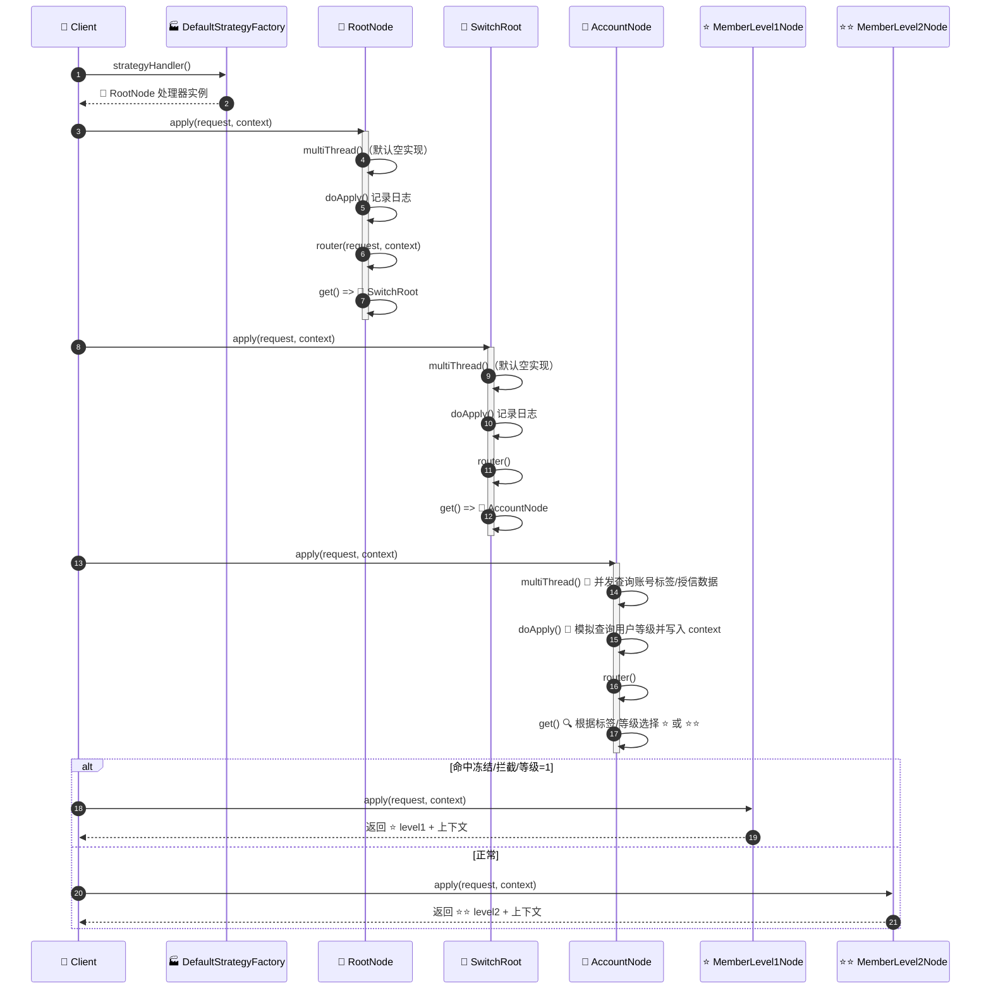
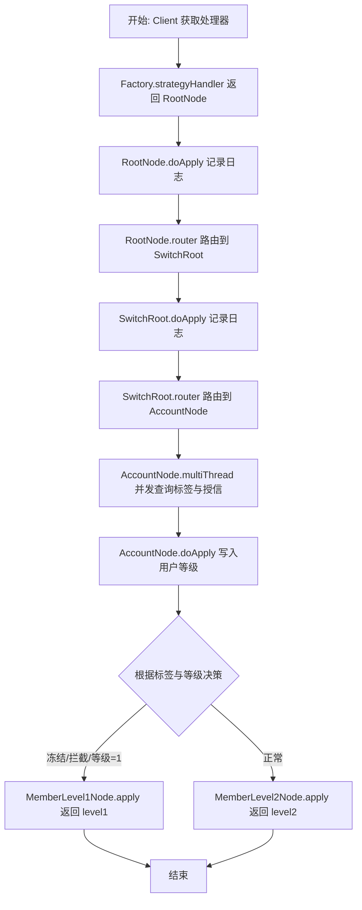
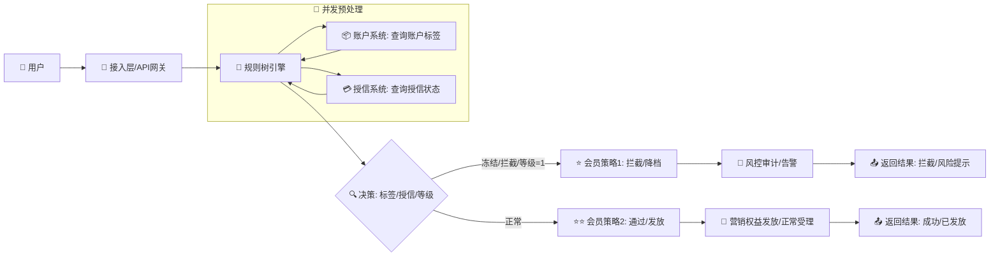
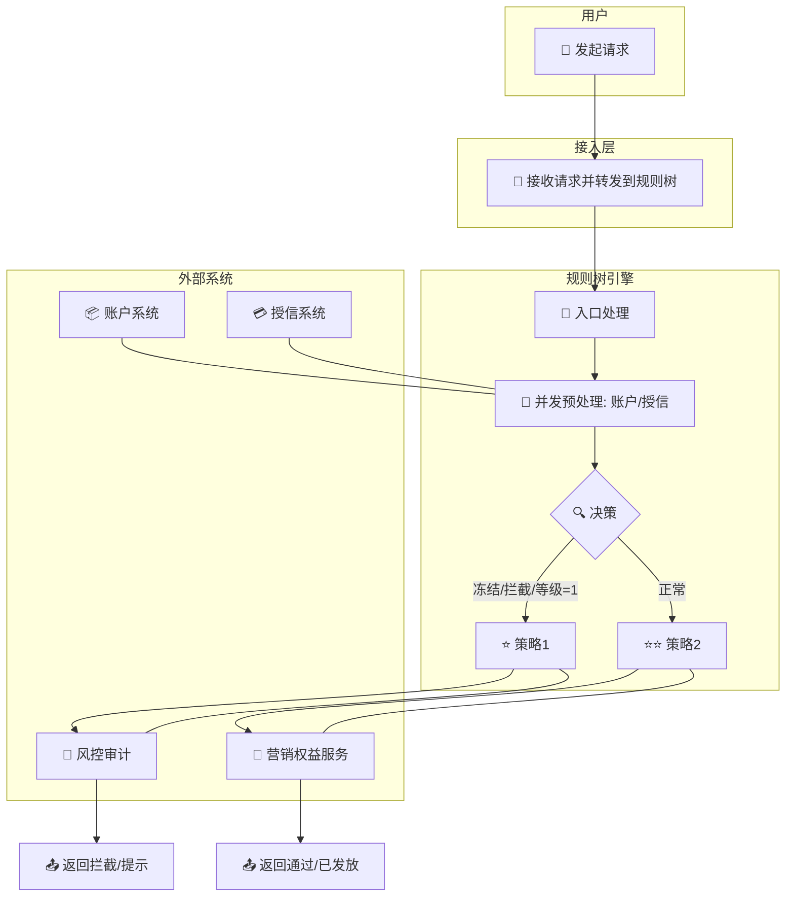

# 规则树与责任链设计说明（无依赖注入版）

本文解释当前示例目录 `com.zsq.winter.examples.tree` 的设计与执行流程，并对“规则树（Strategy Router）”与“责任链（Chain of Responsibility）”两种模式的协作方式进行说明。示例代码已改造成不依赖Spring等DI框架，通过手动装配实现节点之间的依赖关系。

## 业务背景与目标

- 背景：在风控/营销等业务场景中，需要根据用户的“账户标签”（如是否冻结、是否拦截）和“会员等级”等动态信息，决定后续处理策略。例如，在支付受理、账户开户、活动发放等流程中，根据风险与等级做出差异化处理。
- 目标：通过规则树进行“路由决策”，并在必要节点使用并发预处理（如并行查询标签与授信数据），最终将请求导向不同的会员级别策略节点（MemberLevel1/MemberLevel2），返回不同的处理结果或进一步动作。
- 价值：
  - 规则清晰：每个节点聚焦于自身逻辑与决策条件，路由关系一目了然。
  - 性能可控：在含数据密集的节点使用 `multiThread` 并发预处理，降低主流程阻塞。
  - 扩展容易：新增策略节点或调整决策条件，只需在相应节点的 `get()` 方法内变更即可。

## 核心概念

- 规则树（Strategy Router）
  - 以“路由”的方式在多个策略节点间做决策与跳转。
  - 基类 `com.zsq.winter.design.tree.AbstractStrategyRouter` 与 `AbstractMultiThreadStrategyRouter` 定义了路由骨架：
    - `get()` 决策下一个策略节点。
    - `apply()` 执行受理逻辑，`router()` 调用下一个策略节点。
- 责任链（Chain of Responsibility）
  - 多个处理器串联，每个节点按需处理并传递给下一个节点。
  - 在本示例中，规则树的“节点跳转”体现了类似责任链的传递思想：节点在受理后根据上下文选择并“交棒”给下一个节点。

## 示例结构映射

- 示例节点
  - `RootNode`：根节点，调用 `SwitchRoot`。
  - `SwitchRoot`：中间切换节点，路由到 `AccountNode`。
  - `AccountNode`：业务节点，进行异步数据加载与等级判断，路由到 `MemberLevel1Node` 或 `MemberLevel2Node`。
  - `MemberLevel1Node` / `MemberLevel2Node`：叶子节点，返回最终结果。
- 工厂
  - `DefaultStrategyFactory`：手动实例化并组装上述节点与线程池，提供统一入口 `strategyHandler()`。
- 上下文
  - `DefaultStrategyFactory.DynamicContext`：在节点间共享的业务上下文，存储动态数据（如账号标签、等级等）。

## 手动装配（无DI）

示例不再使用 `@Component`、`@Autowired`、`@Resource` 等注解，而是通过构造函数注入：

```
MemberLevel1Node level1 = new MemberLevel1Node();
MemberLevel2Node level2 = new MemberLevel2Node();
ThreadPoolExecutor pool = (ThreadPoolExecutor) Executors.newFixedThreadPool(Runtime.getRuntime().availableProcessors());
AccountNode account = new AccountNode(level1, level2, pool);
SwitchRoot switchRoot = new SwitchRoot(account);
RootNode root = new RootNode(switchRoot);
```

## 执行时序（Sequence Diagram）



## 流程图（Flowchart）



## 业务流程图（Business Process）



### 泳道图（Swimlane）



说明：
- 并发预处理阶段并行查询“账户标签”和“授信状态”，减少主流程阻塞。
- 决策依据包含“账户标签/授信/会员等级”，命中风险时走拦截与审计，否则走发放或正常受理。
- 本图从业务视角展示参与方与结果输出，便于与上下游系统协作对齐。

## 类作用说明

- 🌳 `RootNode`：规则树入口；记录初始日志并路由到 🔀 `SwitchRoot`。
- 🔀 `SwitchRoot`：中间路由；将请求交给 🧮 `AccountNode` 做核心处理。
- 🧮 `AccountNode`：并发预处理（账号标签/授信）；模拟等级计算；按条件路由到 ⭐/⭐⭐ 叶子节点。
- ⭐ `MemberLevel1Node`：叶子分支，代表“低等级/风险触发/拦截”，返回 level1 结果。
- ⭐⭐ `MemberLevel2Node`：叶子分支，代表“较高等级/正常通过”，返回 level2 结果。
- 🏭 `DefaultStrategyFactory`：手动装配全部节点和线程池，提供入口处理器。
- 🧱 `AbstractXxxSupport`：统一抽象基类，定义 multiThread/doApply/router/get 骨架。
- 🚀 `RuleTreeDemo`：演示运行，打印最终路由结果与上下文关键数据。

## 示例代码（带中文注释）

> 以下为关键类的完整代码片段，均已加入中文注释，便于理解每个类的职责与关键逻辑。

### 🧱 AbstractXxxSupport

```java
/**
 * 示例业务节点的统一抽象基类。
 *
 * <p>本抽象类基于 {@link com.zsq.winter.design.tree.AbstractMultiThreadStrategyRouter}
 * 提供“规则树+多线程预处理”的骨架能力：
 * - multiThread：可在进入主受理逻辑前进行并发数据加载或预计算；
 * - doApply：主受理逻辑（通常记录日志与路由到下一个节点）；
 * - router：根据子类实现的 get() 方法选择并调用下一个策略节点。</p>
 *
 * <p>所有具体节点（RootNode、SwitchRoot、AccountNode、MemberLevel1/2）均继承该类，
 * 有需要的节点可重写 multiThread 方法，其他节点可沿用缺省实现。</p>
 */
public abstract class AbstractXxxSupport extends AbstractMultiThreadStrategyRouter<String, DefaultStrategyFactory.DynamicContext, String> {

    @Override
    protected void multiThread(String requestParameter, DefaultStrategyFactory.DynamicContext dynamicContext) throws ExecutionException, InterruptedException, TimeoutException {
        // 缺省实现：无需并发预处理的节点不做任何操作
    }

}
```

### 🌳 RootNode

```java
/**
 * 根节点（🌳 RootNode）：
 *
 * <p>负责规则树的入口处理，通常用于记录入口日志、做初步校验，
 * 并将请求路由到首个业务切换节点 {@link SwitchRoot}。</p>
 */
public class RootNode extends AbstractXxxSupport {

  private static final Logger log = Logger.getLogger(RootNode.class.getName());

  /**
   * 规则树的后继节点：开关路由节点。
   */
  private final SwitchRoot switchRoot;

  public RootNode(SwitchRoot switchRoot) {
    this.switchRoot = switchRoot;
  }

  @Override
  protected String doApply(String requestParameter, DefaultStrategyFactory.DynamicContext dynamicContext) throws Exception {
    log.info("【开关节点】规则决策树 userId:" + requestParameter);
    // 进入路由逻辑，交由 SwitchRoot 做进一步决策
    return router(requestParameter, dynamicContext);
  }

  @Override
  public StrategyHandler<String, DefaultStrategyFactory.DynamicContext, String> get(String requestParameter, DefaultStrategyFactory.DynamicContext dynamicContext) throws Exception {
    // 指定下一个节点为 SwitchRoot
    return switchRoot;
  }

}
```

### 🔀 SwitchRoot

```java
/**
 * 切换节点（🔀 SwitchRoot）：
 *
 * <p>承担规则树中的“中间路由”角色，将请求转交到核心业务节点
 * {@link AccountNode} 去执行并发预处理与策略决策。</p>
 */
public class SwitchRoot extends AbstractXxxSupport {

  private static final Logger log = Logger.getLogger(SwitchRoot.class.getName());

  /**
   * 后继业务节点：账户节点。
   */
  private final AccountNode accountNode;

  public SwitchRoot(AccountNode accountNode) {
    this.accountNode = accountNode;
  }

  @Override
  protected String doApply(String requestParameter, DefaultStrategyFactory.DynamicContext dynamicContext) throws Exception {
    log.info("【开关节点】规则决策树 userId:" + requestParameter);
    // 进入路由，转到 AccountNode 做多线程预处理与分支决策
    return router(requestParameter, dynamicContext);
  }

  @Override
  public StrategyHandler<String, DefaultStrategyFactory.DynamicContext, String> get(String requestParameter, DefaultStrategyFactory.DynamicContext dynamicContext) throws Exception {
    // 指定后继节点为 AccountNode
    return accountNode;
  }

}
```

### 🧮 AccountNode

```java
/**
 * 账户节点（🧮 AccountNode）：
 *
 * <p>核心业务处理节点，具备并发预处理能力：
 * - multiThread：并行查询账户标签与授信信息，写入上下文；
 * - doApply：模拟查询用户等级并写入上下文；
 * - get：根据上下文（标签、授信、等级）路由到会员1或会员2的叶子节点。</p>
 */
public class AccountNode extends AbstractXxxSupport {

  private static final Logger log = Logger.getLogger(AccountNode.class.getName());

  /**
   * 会员等级1叶子节点。
   */
  private final MemberLevel1Node memberLevel1Node;

  /**
   * 会员等级2叶子节点。
   */
  private final MemberLevel2Node memberLevel2Node;

  /**
   * 并发执行线程池（用于异步数据加载）。
   */
  private final ThreadPoolExecutor threadPoolExecutor;

  public AccountNode(MemberLevel1Node memberLevel1Node,
                     MemberLevel2Node memberLevel2Node,
                     ThreadPoolExecutor threadPoolExecutor) {
    this.memberLevel1Node = memberLevel1Node;
    this.memberLevel2Node = memberLevel2Node;
    this.threadPoolExecutor = threadPoolExecutor;
  }

  /**
   * 1. 可执行多线程异步操作，尤其在需要大量加载数据的时候非常有用
   * 2. multiThread 在需要的节点就重写，不需要的节点不用处理
   */
  @Override
  protected void multiThread(String requestParameter, DefaultStrategyFactory.DynamicContext dynamicContext) throws ExecutionException, InterruptedException, TimeoutException {
    // 异步任务1：查询账户标签（开户|冻结|止付|可用）
    CompletableFuture<String> accountType01 = CompletableFuture.supplyAsync(() -> {
      log.info("异步查询账户标签，账户标签；开户|冻结|止付|可用");
      return new Random().nextBoolean() ? "账户冻结" : "账户可用";
    }, threadPoolExecutor);

    // 异步任务2：查询授信信息（拦截|已授信|已降档）
    CompletableFuture<String> accountType02 = CompletableFuture.supplyAsync(() -> {
      log.info("异步查询授信数据，拦截|已授信|已降档");
      return new Random().nextBoolean() ? "拦截" : "已授信";
    }, threadPoolExecutor);

    // 合并结果并写入上下文（等待两个异步任务完成）
    CompletableFuture.allOf(accountType01, accountType02)
            .thenRun(() -> {
              dynamicContext.setValue("accountType01", accountType01.join());
              dynamicContext.setValue("accountType02", accountType02.join());
            }).join();
  }

  @Override
  protected String doApply(String requestParameter, DefaultStrategyFactory.DynamicContext dynamicContext) throws Exception {
    log.info("【账户节点】规则决策树 userId:" + requestParameter);

    // 模拟查询用户级别
    int level = new Random().nextInt(2);
    log.info("模拟查询用户级别 level:" + level);

    // 将等级写入上下文以供后续路由决策
    dynamicContext.setLevel(level);

    return router(requestParameter, dynamicContext);
  }

  @Override
  public StrategyHandler<String, DefaultStrategyFactory.DynamicContext, String> get(String requestParameter, DefaultStrategyFactory.DynamicContext dynamicContext) throws Exception {
    String accountType01 = dynamicContext.getValue("accountType01");
    String accountType02 = dynamicContext.getValue("accountType02");

    int level = dynamicContext.getLevel();

    // 路由策略：若账户冻结或拦截，或等级为1，转向会员1；否则会员2
    if ("账户冻结".equals(accountType01)) {
      return memberLevel1Node;
    }

    if ("拦截".equals(accountType02)) {
      return memberLevel1Node;
    }

    if (level == 1) {
      return memberLevel1Node;
    }

    return memberLevel2Node;
  }

}

```

### ⭐ MemberLevel1Node

```java

/**
 * 会员等级1叶子节点（⭐ MemberLevel1Node）：
 *
 * <p>终止节点之一，代表“低等级/风险触发/拦截”的处理分支。
 * 在本示例中仅记录日志并返回固定结果，同时附带上下文内容便于观察。</p>
 */
public class MemberLevel1Node extends AbstractXxxSupport {
  private static final Logger log = Logger.getLogger(MemberLevel1Node.class.getName());
  @Override
  protected String doApply(String requestParameter, DefaultStrategyFactory.DynamicContext dynamicContext) throws Exception {
    // 叶子分支：记录日志并返回结果（包含上下文快照）
    log.info("【级别节点-1】规则决策树 userId:" + requestParameter);
    return "level1" + JSON.toJSONString(dynamicContext);
  }

  @Override
  public StrategyHandler<String, DefaultStrategyFactory.DynamicContext, String> get(String requestParameter, DefaultStrategyFactory.DynamicContext dynamicContext) throws Exception {
    // 叶子节点：返回默认处理器以结束路由
    return defaultStrategyHandler;
  }
}
```

### ⭐⭐ MemberLevel2Node

```java
/**
 * 会员等级2叶子节点（⭐⭐ MemberLevel2Node）：
 *
 * <p>终止节点之一，代表“较高等级/正常通过”的处理分支。
 * 在本示例中记录日志并返回固定结果，同时附带上下文内容便于观察。</p>
 */
public class MemberLevel2Node extends AbstractXxxSupport {
  private static final Logger log = Logger.getLogger(MemberLevel2Node.class.getName());

  @Override
  protected String doApply(String requestParameter, DefaultStrategyFactory.DynamicContext dynamicContext) throws Exception {
    // 叶子分支：记录日志并返回结果（包含上下文快照）
    log.info("【级别节点-2】规则决策树 userId:" + requestParameter);
    return "level2" + JSON.toJSONString(dynamicContext);
  }

  @Override
  public StrategyHandler<String, DefaultStrategyFactory.DynamicContext, String> get(String requestParameter, DefaultStrategyFactory.DynamicContext dynamicContext) throws Exception {
    // 叶子节点：返回默认处理器以结束路由
    return defaultStrategyHandler;
  }

}
```

### 🏭 DefaultStrategyFactory

```java
/**
 * 默认策略工厂（🏭 DefaultStrategyFactory）：
 *
 * <p>用于手动装配整个规则树，替代框架/容器注入。该工厂：
 * - 创建线程池用于节点的并发预处理；
 * - 手动实例化并串联各节点（Level1/Level2 -> Account -> SwitchRoot -> Root）；
 * - 暴露统一的 {@link #strategyHandler()} 获取入口处理器。</p>
 */
public class DefaultStrategyFactory {

  private final RootNode rootNode;

  private final ThreadPoolExecutor threadPoolExecutor;

  public DefaultStrategyFactory() {
    // 基于 CPU 核心数初始化固定大小线程池（用于示例并发预处理）
    this.threadPoolExecutor = (ThreadPoolExecutor) Executors.newFixedThreadPool(Runtime.getRuntime().availableProcessors());
    // 手动装配规则树
    MemberLevel1Node level1 = new MemberLevel1Node();
    MemberLevel2Node level2 = new MemberLevel2Node();
    AccountNode account = new AccountNode(level1, level2, threadPoolExecutor);
    SwitchRoot switchRoot = new SwitchRoot(account);
    this.rootNode = new RootNode(switchRoot);
  }

  public StrategyHandler<String, DynamicContext, String> strategyHandler() {
    // 返回规则树入口处理器（RootNode）
    return rootNode;
  }

  @Data
  @Builder
  @AllArgsConstructor
  @NoArgsConstructor
  public static class DynamicContext {

    /**
     * 用户等级（由 AccountNode 计算写入）。
     */
    private int level;

    /**
     * 通用键值数据容器，用于存放并发预处理的结果。
     */
    private Map<String, Object> dataObjects = new HashMap<>();

    /**
     * 写入上下文数据。
     */
    public <T> void setValue(String key, T value) {
      dataObjects.put(key, value);
    }

    /**
     * 读取上下文数据（泛型返回）。
     */
    @SuppressWarnings("unchecked")
    public <T> T getValue(String key) {
      return (T) dataObjects.get(key);
    }

  }

}
```

### 🚀 RuleTreeDemo

```java
/**
 * 演示类（🚀 RuleTreeDemo）：
 *
 * <p>示例如何手动装配并运行规则树：
 * - 构造 {@link DefaultStrategyFactory} 并获取入口处理器；
 * - 创建上下文并执行 apply；
 * - 打印路由结果与上下文关键数据。</p>
 *
 * <p>运行方式：直接运行 main 方法，可传入可选的 userId 参数。
 * 例如：`java RuleTreeDemo user-1001`。</p>
 */
public class RuleTreeDemo {

  public static void main(String[] args) throws Exception {
    // 手动装配规则树（见 DefaultStrategyFactory 构造器）
    DefaultStrategyFactory factory = new DefaultStrategyFactory();
    StrategyHandler<String, DefaultStrategyFactory.DynamicContext, String> handler = factory.strategyHandler();

    // 构造上下文并执行
    DefaultStrategyFactory.DynamicContext ctx = new DefaultStrategyFactory.DynamicContext();
    String userId = args.length > 0 ? args[0] : "user-1001";

    String result = handler.apply(userId, ctx);

    // 打印结果与上下文数据（包含并发预处理写入与等级决策）
    System.out.println("Routing result for " + userId + ": " + result);
    System.out.println("Context: accountType01=" + ctx.getValue("accountType01")
            + ", accountType02=" + ctx.getValue("accountType02")
            + ", level=" + ctx.getLevel());
  }
}
```

## 设计要点与取舍

- 规则树负责“选择策略”，责任链负责“串行处理”的组织形态。在本示例中，节点的 `get()` 方法将两者融合：在完成本节点处理后，依据上下文选择后续节点并传递。
- 多线程预处理（`multiThread`）仅在需要的节点实现，避免所有节点都承担并发开销。
- 无DI时，通过构造函数明确依赖关系，有利于测试与可读性；装配集中在 `DefaultStrategyFactory`，责任边界清晰。

## 如何使用

- 创建工厂并获取处理器：

```
DefaultStrategyFactory factory = new DefaultStrategyFactory();
StrategyHandler<String, DefaultStrategyFactory.DynamicContext, String> handler = factory.strategyHandler();
DefaultStrategyFactory.DynamicContext ctx = new DefaultStrategyFactory.DynamicContext();
String result = handler.apply("userId-123", ctx);
```

- 执行过程会根据上下文中的异步加载数据和等级，自动路由到不同的会员级别节点返回结果。

## 快速试跑

- 运行示例类：`com.zsq.winter.examples.tree.RuleTreeDemo`
- 程序会：
  - 手动装配规则树（工厂构造器内完成）。
  - 执行 `apply(userId, ctx)`，并输出最终路由结果与上下文数据（账号标签、授信标签、等级）。
  - 可通过命令行参数传入 `userId`，默认 `user-1001`。

## 小结

该示例通过“规则树 + 责任链”的组合，既能在流程中灵活决策，又能保持处理逻辑的可扩展性与清晰性。移除依赖注入后，整体结构更为显式，便于理解与单元测试。