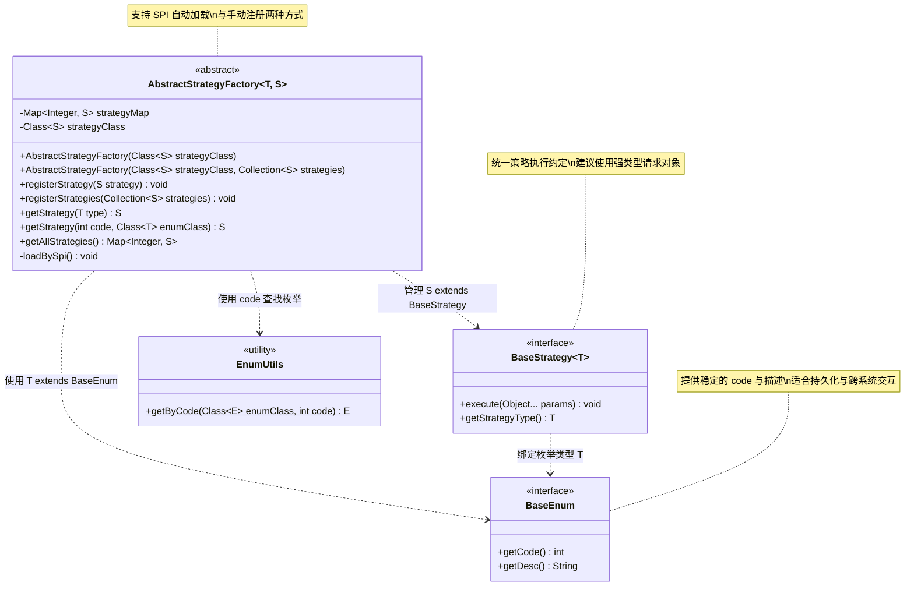
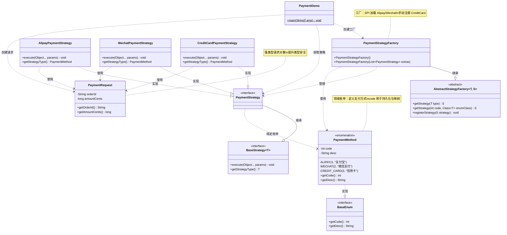
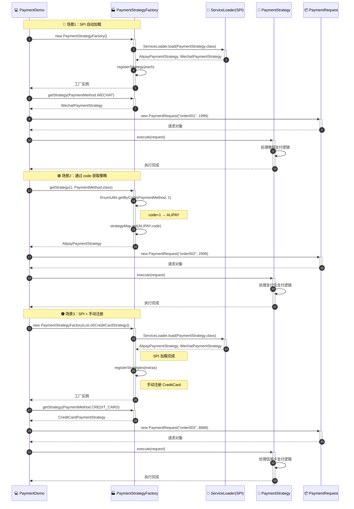
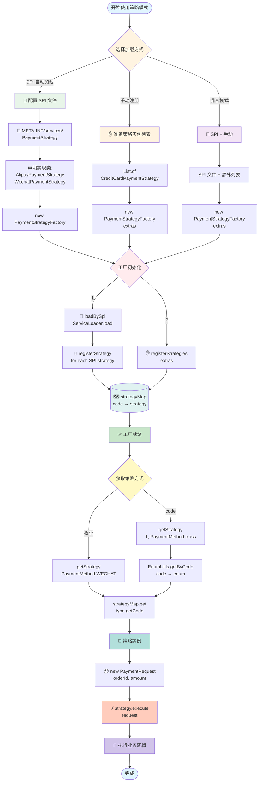
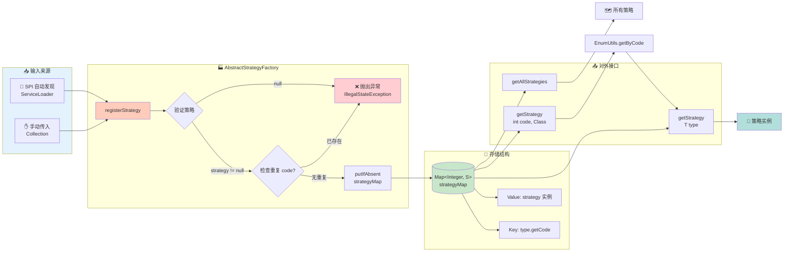

# Winter Design DDC Spring Boot Starter

> 为业务应用提供通用、抽象且可扩展的设计模式模板。本项目示范了“策略模式”的标准抽象与在支付域的落地实现，支持 Java SPI 自动发现与运行期手动注册，面向开源项目的阅读与扩展体验进行了优化。

## 目录
- [设计思想](#设计思想)
- [核心抽象（策略模式）](#核心抽象策略模式)
- [模型设计图](#模型设计图)
- [示例模块与整体实现图](#示例模块与整体实现图)
- [快速开始](#快速开始)
- [扩展新的策略](#扩展新的策略)
- [注意事项](#注意事项)
- [License](#license)

## 设计思想
- 用领域枚举绑定策略，枚举提供稳定的 `code` 与人类可读的 `desc`；工厂以 `code → strategy` 映射管理策略实现。
- 策略接口统一约定 `execute(Object...)` 与 `getStrategyType()`；建议将实际入参封装为强类型领域对象（如 `PaymentRequest`），提升类型安全与可维护性。
- 工厂支持两种来源：
  - Java SPI 自动发现：在 `META-INF/services/<策略接口全名>` 中声明实现类，构造工厂时自动加载。
  - 运行期手动注册：构造或调用时追加策略，实现更灵活的扩展场景。
- 通过 `EnumUtils.getByCode` 从整型 `code` 安全映射到枚举实例，适合持久化、对外协议或前端传参场景。

## 核心抽象（策略模式）
```java
// BaseEnum：统一的枚举抽象接口
public interface BaseEnum {
    int getCode();
    String getDesc();
}

// BaseStrategy：通用策略接口，绑定枚举类型 T
public interface BaseStrategy<T extends Enum<T> & BaseEnum> {
    void execute(Object... params);
    T getStrategyType();
}

// EnumUtils：按 code 查找枚举实例
public final class EnumUtils {
    public static <E extends Enum<E> & BaseEnum> E getByCode(Class<E> enumClass, int code) { /*...*/ }
}

// AbstractStrategyFactory：策略工厂（SPI + 手动注册）
public abstract class AbstractStrategyFactory<T extends Enum<T> & BaseEnum, S extends BaseStrategy<T>> {
    public void registerStrategy(S strategy) { /*...*/ }
    public void registerStrategies(Collection<S> strategies) { /*...*/ }
    public S getStrategy(T type) { /*...*/ }
    public S getStrategy(int code, Class<T> enumClass) { /*...*/ }
    public Map<Integer, S> getAllStrategies() { /*...*/ }
}
```

### 为什么这么做，带来哪些好处
- 解耦与内聚：业务枚举明确策略类型边界，策略实现仅关注自身逻辑；工厂负责生命周期与查找，职责清晰。
- 可插拔扩展：SPI 自动发现让新增策略“零改造”；手动注册适配运行期动态扩展或非 SPI 场景。
- 统一映射与稳定标识：以枚举 `code` 为唯一键，便于持久化与跨系统交互，同时保留 `desc` 作为展示文案。
- 类型安全的调用约定：建议用强类型请求对象承载入参，避免 `Object...` 的不安全使用。
- 简化使用：通过枚举或 `code` 即可获取策略，支持多种接入方式（枚举、整型、SPI）。

## 模型设计图
策略抽象的架构图（strategy 文件夹核心类关系）：



## 示例模块与整体实现图
### 完整代码示例

#### 1. 支付方式枚举（PaymentMethod.java）

```java
package com.zsq.winter.examples.payment;

import com.zsq.winter.design.strategy.BaseEnum;

/**
 * 支付方式枚举，实现 BaseEnum 以提供稳定的 code 与描述。
 */
public enum PaymentMethod implements BaseEnum {
    ALIPAY(1, "支付宝"),
    WECHAT(2, "微信支付"),
    CREDIT_CARD(3, "信用卡");

    private final int code;
    private final String desc;

    PaymentMethod(int code, String desc) {
        this.code = code;
        this.desc = desc;
    }

    @Override
    public int getCode() { 
        return code; 
    }

    @Override
    public String getDesc() { 
        return desc; 
    }
}
```

#### 2. 策略接口（PaymentStrategy.java）

```java
package com.zsq.winter.examples.payment;

import com.zsq.winter.design.strategy.BaseStrategy;

/**
 * 支付策略接口，绑定到 {@link PaymentMethod} 枚举。
 */
public interface PaymentStrategy extends BaseStrategy<PaymentMethod> {
}
```

#### 3. 策略工厂（PaymentStrategyFactory.java）

```java
package com.zsq.winter.examples.payment;

import com.zsq.winter.design.strategy.AbstractStrategyFactory;

import java.util.List;

/**
 * 支付策略工厂，支持 SPI 自动加载与手动追加策略。
 */
public class PaymentStrategyFactory extends AbstractStrategyFactory<PaymentMethod, PaymentStrategy> {

    /**
     * 仅通过 SPI 加载策略实现。
     */
    public PaymentStrategyFactory() {
        super(PaymentStrategy.class);
    }

    /**
     * 通过 SPI 加载并追加手动传入的策略实现。
     *
     * @param extraStrategies 需要额外注册的策略列表
     */
    public PaymentStrategyFactory(List<PaymentStrategy> extraStrategies) {
        super(PaymentStrategy.class, extraStrategies);
    }
}
```

#### 4. 请求模型（PaymentRequest.java）

```java
package com.zsq.winter.examples.payment;

/**
 * 简单的支付请求模型，用于作为策略执行的入参。
 */
public class PaymentRequest {
    private final String orderId;
    private final long amountCents;

    public PaymentRequest(String orderId, long amountCents) {
        this.orderId = orderId;
        this.amountCents = amountCents;
    }

    public String getOrderId() {
        return orderId;
    }

    public long getAmountCents() {
        return amountCents;
    }

    @Override
    public String toString() {
        return "PaymentRequest{" +
                "orderId='" + orderId + '\'' +
                ", amountCents=" + amountCents +
                '}';
    }
}
```

#### 5. 支付宝策略实现（AlipayPaymentStrategy.java）

```java
package com.zsq.winter.examples.payment;

/**
 * 支付宝支付策略实现。
 */
public class AlipayPaymentStrategy implements PaymentStrategy {

    @Override
    public void execute(Object... params) {
        PaymentRequest req = (PaymentRequest) params[0];
        System.out.println("[Alipay] 支付订单:" + req.getOrderId() + ", 金额:" + req.getAmountCents());
    }

    @Override
    public PaymentMethod getStrategyType() {
        return PaymentMethod.ALIPAY;
    }
}
```

#### 6. 微信支付策略实现（WechatPaymentStrategy.java）

```java
package com.zsq.winter.examples.payment;

/**
 * 微信支付策略实现。
 */
public class WechatPaymentStrategy implements PaymentStrategy {

    @Override
    public void execute(Object... params) {
        PaymentRequest req = (PaymentRequest) params[0];
        System.out.println("[Wechat] 支付订单:" + req.getOrderId() + ", 金额:" + req.getAmountCents());
    }

    @Override
    public PaymentMethod getStrategyType() {
        return PaymentMethod.WECHAT;
    }
}
```

#### 7. 信用卡支付策略实现（CreditCardPaymentStrategy.java）

```java
package com.zsq.winter.examples.payment;

/**
 * 信用卡支付策略实现（示例中通过手动注册）。
 */
public class CreditCardPaymentStrategy implements PaymentStrategy {

    @Override
    public void execute(Object... params) {
        PaymentRequest req = (PaymentRequest) params[0];
        System.out.println("[CreditCard] 支付订单:" + req.getOrderId() + ", 金额:" + req.getAmountCents());
    }

    @Override
    public PaymentMethod getStrategyType() {
        return PaymentMethod.CREDIT_CARD;
    }
}
```

#### 8. 使用示例（PaymentDemo.java）

```java
package com.zsq.winter.examples.payment;

import java.util.Arrays;

/**
 * 支付策略使用示例：演示 SPI 加载与手动追加策略的组合使用。
 */
public class PaymentDemo {
    public static void main(String[] args) {
        // 示例 1：仅使用 SPI 加载（Alipay、Wechat）
        PaymentStrategyFactory spiFactory = new PaymentStrategyFactory();
        PaymentRequest req1 = new PaymentRequest("order001", 1999);
        PaymentStrategy wechat = spiFactory.getStrategy(PaymentMethod.WECHAT);
        if (wechat != null) {
            wechat.execute(req1);
        }

        // 通过 code 获取策略（等同于上面的枚举方式）
        PaymentStrategy alipay = spiFactory.getStrategy(1, PaymentMethod.class);
        if (alipay != null) {
            alipay.execute(new PaymentRequest("order002", 2999));
        }

        // 示例 2：在 SPI 基础上手动追加（CreditCard）
        PaymentStrategyFactory mixedFactory = new PaymentStrategyFactory(
                Arrays.asList(new CreditCardPaymentStrategy())
        );
        PaymentStrategy card = mixedFactory.getStrategy(PaymentMethod.CREDIT_CARD);
        if (card != null) {
            card.execute(new PaymentRequest("order003", 8888));
        }
    }
}
```

#### 9. SPI 配置文件

在 `src/main/resources/META-INF/services/` 目录下创建文件：

文件名：`com.zsq.winter.examples.payment.PaymentStrategy`

文件内容：
```
com.zsq.winter.examples.payment.AlipayPaymentStrategy
com.zsq.winter.examples.payment.WechatPaymentStrategy
```

#### 10. 运行输出

```
[Wechat] 支付订单:order001, 金额:1999
[Alipay] 支付订单:order002, 金额:2999
[CreditCard] 支付订单:order003, 金额:8888
```

### 支付域类关系图



### 策略执行流程图



### 策略注册与查找流程图



### 工厂内部注册机制详解




## 扩展新的策略
- 新增枚举项并确保 `code` 唯一与稳定（适合持久化与跨系统交互）。
- 新增策略实现并返回该枚举项；入参尽量使用强类型请求对象以确保类型安全。
- 选择 SPI 或手动注册：
  - SPI：在 `META-INF/services/<策略接口全名>` 添加实现类全名，工厂自动发现。
  - 手动：在构造工厂或运行时调用 `registerStrategies(...)` 追加。

## 注意事项
- 并发与生命周期：默认实现未做并发保护，建议在应用启动阶段完成策略注册（实现 InitializingBean 或使用 @PostConstruct）；如需运行期动态变更，请在外层加同步控制。

## License
本项目基于 Apache-2.0 许可证发布，详情参见 [pom.xml 中的声明](../pom.xml)。